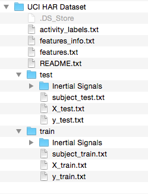
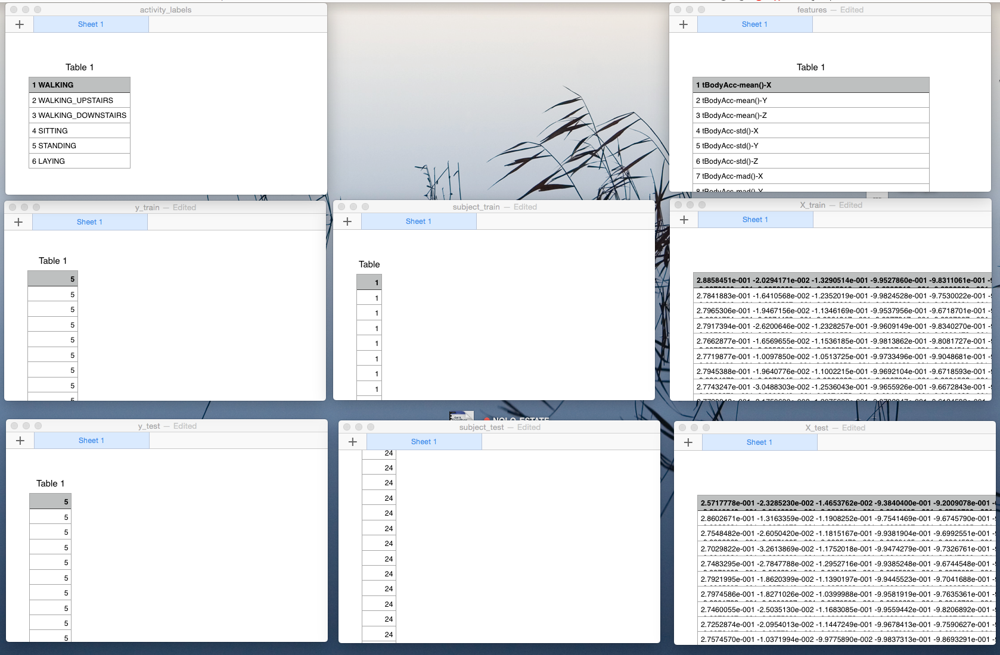

# Codebook for the Getting and Cleaning Data Course Project

## Introduction

One of the most exciting areas in all of data science right now is wearable computing - see for example [this article](http://www.insideactivitytracking.com/data-science-activity-tracking-and-the-battle-for-the-worlds-top-sports-brand/). Companies like Fitbit, Nike, and Jawbone Up are racing to develop the most advanced algorithms to attract new users

The data used for this project represent data collected from the accelerometers from the Samsung Galaxy S smartphone. A full description is available at the site where the data was obtained:

- http://archive.ics.uci.edu/ml/datasets/Human+Activity+Recognition+Using+Smartphones

The actual input data for this project are obtained via the URL:

- https://d396qusza40orc.cloudfront.net/getdata%2Fprojectfiles%2FUCI%20HAR%20Dataset.zip

This project is comprised of an R script---called *run_analysis.R*---that does the following:

1. Merges the training and the test sets to create one data set.
2. Extracts only the measurements on the mean and standard deviation for each measurement.
3. Uses descriptive activity names to name the activities in the data set
4. Appropriately labels the data set with descriptive variable names.
5. From the data set in step 4, creates a second, independent tidy data set with the average of each variable for each activity and each subject.

The project also includes this codebook, *CodeBook.md*, plus a basic *README.md* file.  *README.md* should also be reviewed before running the *run_analysis.R* script.

### Resulting Datasets

Steps 1-4 above produce a dataset named **mergedData**.

Step 5 produces a dataset named **groupedMeans**.

See the following **Input Data** and **Output Data** sections---along with the commented code of the script *run_analysis.R*---for precisely how this pair of tidy datasets is produced, and what each contains.

## Input Data (aka "raw" data)

We download the zip file provided by the second (2nd) URL above, and then we unzip it.  The result is the directory named *UCI HAR Dataset*, which is laid out as follows:

It contains eight (8) dataset files of interest:

- activity_labels.txt
- features.txt
- subject_test.txt
- X_test.txt
- y_test.txt
- subject_train.txt
- X_train.txt
- y_train.txt

There are also a pair of codebook-like documents:

- README.txt (the primary document)
- features_info.txt (the secondary document)

Their contents are not restated here, except to note that the filename suffixes *train.txt* and *test.txt* denote data to be used for data analysis *training* and *testing* purposes, respectively.  (The first two files listed above are not specific to either data analysis use.)

Note that the two *Inertial Signals* subdirectories contain true raw data, namely data that served as input to *X_test.txt* and *Y_test.txt*, as discussed in the above codebook-like documents.  The contents of these subdirectories are not used here.

Here is an illustration of what our input dataset files contain:

At a glance, some observations are readily apparent about these datasets.

### activity_lables.txt

This dataset associates integers with a small number of named activities.

### y_train.txt and y_test.txt

Each row of these two datasets corresponds to an observation, where an observation's identitiy is captured by its position (i.e., row number) in the respective dataset.  Each observation is associated with a single variable, namely the integer encoding of an activity.

Hence each observation can be easily mapped to its corresponding activity name.

Note that there are 7352 training observations, and 2947 testing observations.

### subject_train.txt and subject_test.txt

These datasets also contain 7352 and 2947 observations, respectively, where each observation is identified by its position within its dataset.

The only data present for an observation is the integer id given to the study's participating subject.  Of the 30 subjects total, 21 (or 70 percent) effectively contributed training data, and the other 9 (or 30 percent) effectively contributed testing data.

Thus each of these datasets' observations are drawn from a subset of integers in the range 1 to 30, inclusive.  Each integer identifies a specific study participant.

### features.txt

These are the shorthand variable names of the distinct measurements that were captured for each-and-every observation of a subject-activity combination during the HAR study in question.  There are 561 such measurements, and hence 561 corresponding variable names.

### X_train.txt and X_test.txt

As we have seen above, once again we have a pair of datasets containing 7352 and 2947 observations, respectively, where each observation is identified by its position within its dataset.

Indeed, the n'th rows of *y_train.txt*, *subject_train.txt* and *X_train.txt* are for the same data observation, namely observation n.  Ditto for rows n of *y_test.txt*, *subject_test.txt* and *X_test.txt*.  This is the fundamental correspondence among each trio of datasets.

Yet what data are recorded in *X_train.txt* and *X_test.txt*?  The answer is that each of their observations contains a space-separated string listing the 561 measurements whose shorthand names are recorded in the 561-row dataset *features.txt*.

Further, each observation's measurements are listed in the same order as rows of the *features.txt* dataset.  Thus a pair of 561-column tables can easily be derived from *X_train.txt* and *X_test.txt*, where each column is named acccording to the respective row of the *features.txt* dataset.

## Output Data

**Note:**  For data-processing specifics, see the commented code of the accompanying script *run_analysis.R*.

### mergedData

Simply put, **mergedData** is produced by melding together the eight (8) input datasets outlined above.  The result is a comprehensive dataset that has been trimmed down to contain all 86 *mean* and *standard deviation* measurements---as opposed to all 561 measurements---for each and every training and testing observation.  As expected, this dataset contains a total of 10,299 observations (7352 training observations plus 2947 testing ones).

In order, **mergedData**'s left-most columns are named as follows:

- *Activity*---each observation having the value WALKING, WALKING_UPSTAIRS, WALKING_DOWNSTAIRS, SITTING, STANDING, or LAYING
- *Subject*---each observation having an integer value in the range 1 through 30
- *DataUse*---each observating having the value Training or Testing

For grouping purposes (see below), these columns are designated to be factors.

The remaining 86 columns are named with their corresponding shorthand names as specified in the *features.txt* dataset.  Again, they contain a series of study measurements, as stated above.  Each of their observations is a double-precision number.  Their specific units-of-measurement are outlined in the original codebook-like files README.txt and/or features_info.txt.

### groupedMeans

The summary dataset **groupedMeans** is simply an aggregation of **mergedData**'s 86 measurement variables, where the mean of each is taken for every distinct combination (or grouping) of **mergedData**'s *Subject*, *Activity* and *DataUse* factors.

### A note about the *DataUse* factor

In the above pair of datasets---**mergedData** and **groupedMeans**---it is the case that each specific value of *Subject* implies a specific value of *DataUse*, namely Training or Testing.  Thus in a certain sense it is redundant to carry each row's value of *DataUse*, and to support grouping by it.

Nonetheless, *DataUse* is incorporated to allow each dataset to be easily and directly partitioned into Training and Testing subsets.

